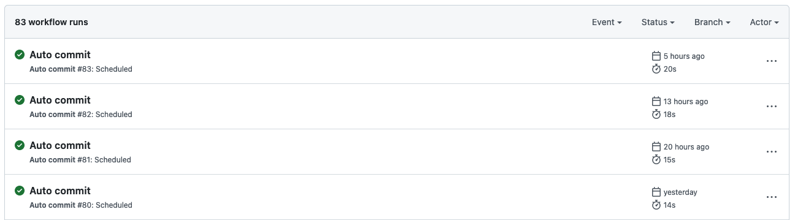

# Github auto-commit

🌳 Making green your Github stats, powered by [GitHub Actions](https://github.com/features/actions).

**Note:**
This is just a sample of GitHub auto-commit using [GitHub Actions](https://github.com/features/actions),
currently GitHub stats is not counting any commits coming from this repository.

## Make it your own

- Create your own repo with click "**Use this template**" button (forked repo will not work)

Or just do in the manual way:

- Create your own repo
- Copy file `.github/workflows/autocommit.yml` and `LAST_UPDATED` to your repo
- Change the `email` and `name` information on file [autocommit.yml, line 29 and 30](https://github.com/mazipan/auto-commit/blob/master/.github/workflows/autocommit.yml#L29)
- Change the scheduling time on file [autocommit.yml, line 10](https://github.com/mazipan/auto-commit/blob/master/.github/workflows/autocommit.yml#L10). You can use [crontab.guru](https://crontab.guru/) if you are not familiar with the cron schedule string. For first time, you can try to run it in every hour with string `1 * * * *` .
- Consider to support me, at least click the 🌟 button

## Article (in Bahasa Indonesia)

- [Membuat commit otomatis ke Github](https://mazipan.space/membuat-commit-otomatis-ke-github)

## Repo using this auto-commit

- [agung2001/auto-commit](https://github.com/agung2001/auto-commit)

## Credits

- [GitHub Actions](https://github.com/features/actions)
- [GitHub - ad-m/github-push-action](https://github.com/ad-m/github-push-action)
- [GitHub - mazipan/auto-commit](https://github.com/mazipan/auto-commit)

---

© 2020 Crafted by [Irfan Maulana](https://github.com/mazipan)

